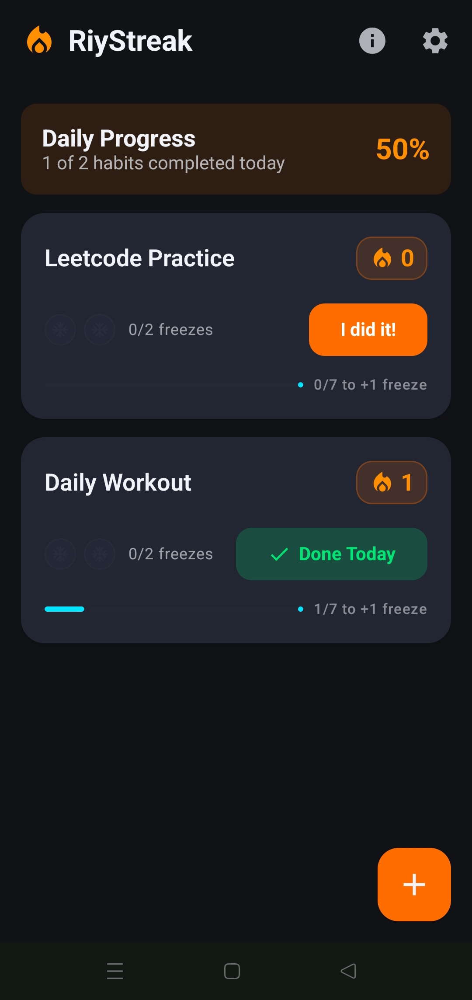
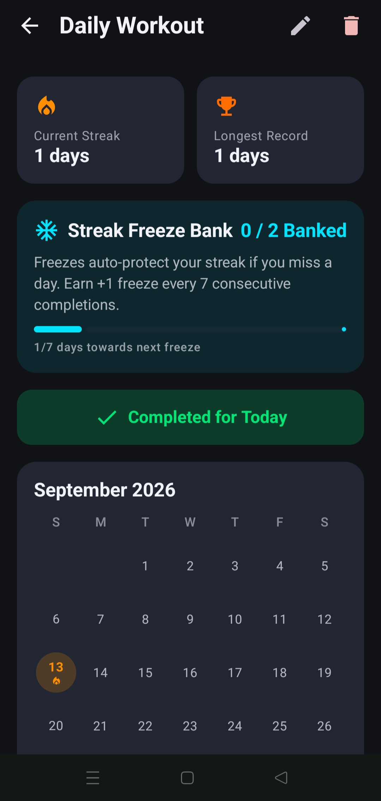
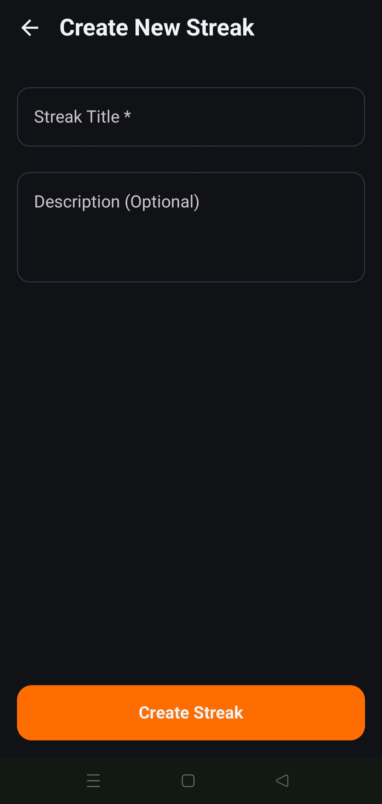

# 🔥 RiyStreak — Native Android Streak Counter & Habit Tracker

> *A native Android general habit tracker built around a Duolingo-style streak counter with proactive, auto-protecting streak freezes.*

[](#tech-stack)
[](https://kotlinlang.org/)
[](https://developer.android.com/jetpack/compose)
[](https://developer.android.com/training/data-storage/room)
[](LICENSE)

---

## 🌟 Overview

**RiyStreak** helps you commit to daily habits (e.g., *"Read 10 pages"*, *"LeetCode daily"*, *"No smoking"*) with standard streak incrementing and a deliberate forgiveness mechanic inspired by Duolingo research.

Miss a day? Banked streak freezes silently cover your missed day without breaking your streak count or forcing an immediate decision at the moment of failure. No lessons, no gems economy, no social ads — just a clean, isolated habit loop.

---

## 🎨 App Screenshots

| Home Feed | Streak Detail & History | Add/Edit Streak |
|:---:|:---:|:---:|
|  |  |  |

---

## 🚀 Key Features

- **Multiple Independent Streaks**: Track unlimited habits simultaneously, each with its own count, history calendar, and dedicated freeze bank.
- **Pure Date-Driven Calculation**: Streak counts and missed day evaluations are computed on-demand upon app launch, button tap, or widget access. Eliminates unreliability caused by OEM battery managers or delayed midnight background timers.
- **Proactive Streak Freeze Bank**:
  - Automatically earns **+1 freeze for every 7 consecutive completions**.
  - Banked freezes **auto-protect missed days silently** (capped at 2 max per habit to preserve habit discipline).
  - Preserves permanent personal records (**Longest Streak** record).
- **Digested Evening Reminders**: WorkManager schedules a single non-intrusive digested daily reminder listing open habits with quick completion buttons right in the notification.
- **Jetpack Glance Home Widget**: Place per-streak Glance widget instances on your Android home screen to view counts and complete habits with a single tap.
- **100% On-Device & Private**: Zero network transmission, zero tracking SDKs, zero accounts required. All data resides in local Room SQLite storage.

---

## 🛠️ Tech Stack & Architecture

RiyStreak is engineered following modern Android development best practices:

- **Language**: Kotlin 2.0+
- **UI Toolkit**: Jetpack Compose + Navigation Compose
- **Architecture Pattern**: MVVM (ViewModel + StateFlow) with Repository pattern over Room
- **Local Persistence**: Room Database (SQLite) & Jetpack DataStore Preferences
- **Home Widget**: Jetpack Glance (AppWidget)
- **Background Tasks**: WorkManager (Digested non-exact notification scheduling)
- **Target SDK**: API 36 (Android 16), Minimum SDK: API 26 (Android 8.0)

### Project Architecture Diagram

```
UI Layer (Jetpack Compose Screens & Glance Widget)
   └── ViewModel (StateFlow UI State)
        └── StreakRepository (Pure Date Evaluation Engine)
             ├── Room Database (Streak & DayLog entities)
             └── DataStore Preferences (AppSettings)
```

---

## 💻 Build & Development Setup

### Prerequisites
- **JDK 17 or JDK 21** installed (`JAVA_HOME` configured)
- **Android SDK (API 36)** installed

### Build Steps

1. **Clone the repository:**
   ```bash
   git clone https://github.com/NickAb04/Simple-Mobile-Streak-Counter-Application.git
   cd Simple-Mobile-Streak-Counter-Application
   ```

2. **Build debug APK:**
   ```bash
   ./gradlew assembleDebug
   ```
   The compiled APK will be located at `app/build/outputs/apk/debug/app-debug.apk`.

3. **Run Unit Tests:**
   ```bash
   ./gradlew testDebugUnitTest
   ```

4. **Install to connected device via USB Debugging:**
   ```bash
   adb install -r app/build/outputs/apk/debug/app-debug.apk
   ```

---

## 🔒 Privacy & Security

RiyStreak values your data privacy. The app requires no internet permissions, collects zero analytics, and stores all habit records 100% locally on device.

Read our complete [Privacy Policy](PRIVACY_POLICY.md).

---

## 💖 Support & Contributions

RiyStreak is a non-commercial open-source project. If this app helps you stay consistent with your habits, consider supporting development:

- ⭐️ **Star** this repository on GitHub!
- 💖 **GitHub Sponsors**: [YOUR_GITHUB_SPONSORS_LINK_HERE](https://github.com/sponsors/NickAb04) *(Placeholder)*
- ☕️ **Buy Me a Coffee / Ko-fi**: [YOUR_KOFI_LINK_HERE](https://ko-fi.com/) *(Placeholder)*

*(Note: Per Google Play policies, support links exist exclusively on this external GitHub repository page and are never included inside the app binary itself.)*

---

## 📄 License

This project is licensed under the [MIT License](LICENSE).
